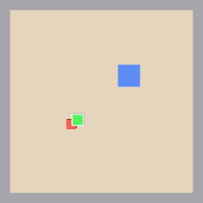
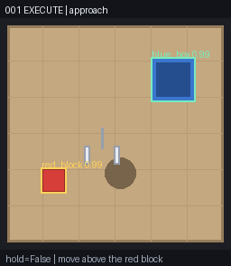
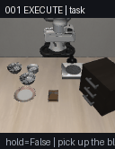

# Robot Vision Copilot

**A teaching-grade robot manipulation stack: an OpenVLA-compatible action-model layer underneath a model-agnostic agent runtime — state machine, action safety validation, failure detection and recovery — verified end to end in three simulators (a zero-dependency tabletop sim, LIBERO, and Gazebo + ROS 2).**

[中文版 README](README.zh-CN.md) · [Docs](docs/) · [Interactive playground](#try-it-in-60-seconds) · [What is real vs. degraded](#honesty-what-is-and-is-not-running-here)

<p align="center">
  
  &nbsp;&nbsp;
  
  &nbsp;&nbsp;
  
</p>
<p align="center"><sub>Left: Gazebo pick-and-place driven from pixels alone (suction grasp with joint-state feedback, pixel-verified placement, 12.2 s). Middle: tabletop sim with a mid-transport slip injected — the agent detects it, replans, and finishes. Right: LIBERO: the behaviour-cloned baseline (trained on this laptop) picks the bowl and places it on the plate.</sub></p>

---

## Why this exists

Vision-language-action models (VLAs) such as OpenVLA answer exactly one question: *given this camera image and this sentence, what is the next 7-DoF end-effector delta?* Everything else a real robot needs — decomposing the task, refusing unsafe outputs, noticing that a grasp failed, deciding what to do about it, knowing when to stop — is **not** the model's job. This repository is a worked example of that separation:

```
                 ┌──────────────────────────────────────────────┐
  action model   │  Policy protocol: (image, instruction) → Action[7]  │
  (swappable)    │  openvla_local · openvla_remote · visual_servo · mock │
                 └───────────────────────┬──────────────────────┘
                                         │  Action [dx dy dz droll dpitch dyaw grip]
                 ┌───────────────────────▼──────────────────────┐
  agent runtime  │  ActionValidator (6 checks + final invariant)  │
  (model-agnostic)│  PERCEIVE → PLAN → EXECUTE → VERIFY → RECOVER │
                 │  RuleBasedPlanner / LLMPlanner.replan()        │
                 └───────────────────────┬──────────────────────┘
                                         │  same interface
              ┌──────────────────────────┼──────────────────────────┐
              ▼                          ▼                          ▼
        TabletopSim                LIBERO (MuJoCo)           Gazebo + ROS 2
        zero-dep teaching sim      official OpenVLA benchmark ros_gz_bridge + agent node
```

`EXECUTE` is the only place in the system that consults a neural network, and the network only ever sees an image and a sentence. Safety, retries and termination live above it, in plain, unit-tested Python.

## Honesty: what is and is not running here

This project was built and verified on a **MacBook Air M3 (16 GB unified memory, no CUDA)**. That machine cannot run OpenVLA-7B: the bf16 weights alone are 15.08 GB, 4-bit `bitsandbytes` is CUDA-only, and CPU inference of a 7B VLA is tens of seconds per step. So:

| Layer | What actually runs today | What is built and waiting for a GPU |
|---|---|---|
| Action model | `ScriptedMockPolicy` (reads sim state, tabletop only), `VisualServoPolicy` (**pixels only**, used in Gazebo) and **`LiberoBCPolicy`** — a behaviour-cloned ResNet18×2+MLP trained locally on LIBERO's 50 human demos, a real learned policy on the real benchmark — all stamped `degraded=true` ("not a VLA") everywhere they appear | `openvla_local.py` (transformers, preflight VRAM/disk checks) and `openvla_remote.py` + `vla_server.py` (run the 7B forward on a cloud GPU, keep the robot stack local); prompt template and `unnorm_key` pairing already wired |
| Perception | `ColorDetector` (RGB thresholds) and a **fine-tuned YOLO11n** trained on auto-labelled synthetic frames | — |
| Planner | `RuleBasedPlanner` (deterministic recovery table); `LLMPlanner` code path complete with structured outputs and bounded replanning, active only when an Anthropic key is present | — |
| Simulators | Tabletop sim, **LIBERO** (installed, 24 ms/step, waiting for a real policy), **Gazebo Harmonic + ROS 2 Jazzy** in a colima container | — |

Every fallback is labelled — in the terminal banner, in `summary.json`, in `/health` and `/infer` — and the backend resolver records *why* each higher-priority backend was skipped. `--no-degraded` refuses to run at all rather than fall back. Nothing here is ever presented as model output when it is not.

## Results

All numbers below are reproducible with a single `make` target and come from real runs on the machine above.

| Claim | Number | Reproduce |
|---|---|---|
| Agent runtime under controlled failures — seeded, replayable rollouts on the tabletop sim (target-lost / grasp-fail / mid-transport slip injected into 375 of 500) | **500 episodes · 100 % success · 100 % recovery on faulted episodes** | `make eval` |
| Safety validator | **0 unsafe actions reached actuation** across 17,478 policy calls; 8.9 % clamped into limits (noise-injected runs) | `make eval` |
| Control-loop latency (full PERCEIVE→VERIFY cycle) | **p95 0.44 ms**, p99 0.90 ms | `make eval` |
| Gazebo pick-and-place, from pixels + joint feedback | INIT→…→VERIFY→**DONE in 12.2 s**, placement error 14 px | `make ros-up` |
| Gazebo visual servo to target | SUCCEEDED in 1.8 s | `make ros-up` |
| Gazebo fault injection (real: joint released / occluder model spawned) | suction loss mid-transport → detected in **40 ms** from joint feedback → re-grasp → DONE; 4 s occlusion → target-lost → 2 recoveries → DONE | `fault_inject.py` in the container |
| **LIBERO behaviour-cloning baseline** (ResNet18×2+MLP, 50 demos, one task, trained on MPS in 19 min — a learned policy, **not a VLA**) | **50 % (25/50)** success over 50 official init states, 7–15 ms/step inference | `make bc-data bc-train bc-eval` |
| LIBERO simulation on Apple silicon | 24 ms/step (two 256² cameras, `MUJOCO_GL=cgl`) | `make setup-libero` |
| Learned detector (YOLO11n, synthetic data, MPS) | P 0.996 / R 0.996 on 150 held-out synthetic frames (colour thresholds: 0.967 / 0.963); ~9 ms per frame; 40 epochs ≈ 10 min | `make yolo` |
| Test suite | 72 tests (LIBERO/YOLO/BC-dependent ones skip themselves without the deps) | `make test` |

The eval report's `provenance` field states explicitly that these measure the **agent runtime**, not any VLA.

## Try it in 60 seconds

```bash
git clone https://github.com/easyrider11/robot-vision-copilot && cd robot-vision-copilot
make setup          # uv venv + numpy + pillow. That is the whole Stage-1 dependency list.
make play           # interactive playground
```

Inside the playground, type instructions and inject faults; the ASCII map and detections are computed from the same rendered image the policy sees:

```
指令> auto                            # full autonomous run through the state machine
指令> reset
指令> move above the red block        # drive it by hand, one subgoal at a time
指令> descend to the red block
指令> close the gripper on the red block
指令> inject slip                     # arm a mid-transport slip
指令> auto                            # watch RECOVER kick in and finish the task
指令> gif                             # export everything you just did
```

Other entry points:

```bash
make demo-libero                      # scripted rollout with per-step explanation + artifacts (GIF, JSONL)
make demo-recover                     # the three fault injections back to back
make eval EPISODES=200                # batch metrics
make serve                            # FastAPI + web panel at http://127.0.0.1:8080  (GET /health, POST /infer, POST /episode)
make bc-data bc-train bc-eval         # LIBERO behaviour-cloning baseline: demos -> train on MPS -> success rate
```

## Stages

The project was built in verifiable stages; each has a doc with what was measured and what broke.

| Stage | What | Status | Doc |
|---|---|---|---|
| 0 | Environment audit — CPU/GPU/disk, what can and cannot run | ✅ | [00](docs/00-environment-audit.md) |
| 1 | Minimal demo: 7-DoF action contract, state machine, validator, fault injection, artifacts | ✅ | [01](docs/01-stage1-demo.md) |
| 1.5 | Real LIBERO: install (6 compat fixes, each with symptom), adapter, `unnorm_key` and gripper-sign conventions | ✅ | [05](docs/05-libero.md) |
| 2 | FastAPI observability service + self-contained web panel | ✅ | [02](docs/02-service.md) |
| 3 | ROS 2 Jazzy + Gazebo Harmonic in a container: floating gripper, visual servo, DetachableJoint grasp, nine-phase pick-and-place | ✅ | [03](docs/03-ros2-gazebo.md) |
| 3+ | Learned perception (YOLO11n on auto-labelled synthetic data), optional LLM planner | ✅ | [06](docs/06-perception-yolo.md) |
| 3++ | **Paths beyond the VLA**: LIBERO behaviour-cloning baseline trained and evaluated locally; real fault injection in Gazebo; the gripper-sign contract bug it exposed | ✅ | [08](docs/08-bc-baseline.md) · [03](docs/03-ros2-gazebo.md) |
| 4 | Real OpenVLA inference + LIBERO evaluation, LoRA fine-tune | 📄 documented, needs a GPU | [04](docs/04-real-openvla.md) |

## Design decisions worth knowing

- **7-DoF action contract** `[dx, dy, dz, droll, dpitch, dyaw, gripper]` matches OpenVLA / LIBERO / RLDS. The gripper-sign conversion (OpenVLA `[0,1]` ↔ LIBERO `[-1,1]`, inverted) lives in exactly one function, because getting it wrong is the classic "the arm never grasps" bug.
- **The validator has a final invariant.** Six checks (NaN, magnitude, rate, gripper chatter, workspace, …) *plus* a last clamp that holds no matter what earlier code did. It exists because the validator itself once emitted a 16× out-of-range correction on LIBERO — the workspace box was hard-coded for the tabletop sim. Bounds are now declared by each environment, or not checked at all.
- **Grasp verification happens during TRANSPORT, not LIFT.** With a top-down camera the block is occluded whether or not the grasp worked while the gripper still hovers over it; only after moving away does "I can still see the block, far from the gripper" mean anything. Same family of insight: *target vanished while the error was already tiny* is arrival, not failure.
- **Every actuator command is closed on sensor feedback.** The first Gazebo run dragged an invisibly-attached block around because fire-and-forget `detach` messages were lost during gz-transport discovery. INIT/GRASP/RELEASE now re-issue until `/gripper/attached_state` confirms — the equivalent of a suction cup's vacuum sensor.
- **Sequencer and servo are pure Python; the ROS node is plumbing.** A 30-line toy kinematic sim in the unit tests caught two design bugs (checking the grasp too early; re-perceiving from the pose that occludes the target) before Gazebo was ever launched.
- **The LLM is optional and boxed in.** `LLMPlanner` decomposes tasks and picks a recovery point, but it can only choose an *existing* subgoal id at or before the failure; anything else — an invented action, a skip-ahead, malformed JSON, a refusal, a timeout — falls back to the deterministic table, and the reason is recorded. Structured outputs make the JSON valid by construction.
- **The contract was wrong once, and nothing caught it.** The gripper sign was written as "0 = open" — the opposite of OpenVLA's dataloader convention. Every component was internally consistent with *some* sign, so all tests passed; the LIBERO hdf5 actions forced the convention onto paper and exposed it. Fixed to OpenVLA's (1 = open), with `tests/test_contract.py` pinning the enum, the LIBERO mapping, the sim, the mock and the validator against the documented source. Lesson: a convention that lives in two places will drift — pin it to an external reference.
- **Recovery attempts must cover time, not just count.** A 3 s occluder in Gazebo burned all three recovery attempts in ~1 s (retreat → look → lost → retreat at 10 Hz). RECOVER now dwells a second before re-approaching; a 4 s occlusion then costs two attempts.
- **Synthetic data with free labels.** The simulator knows where it drew every object, so it labels its own frames; `make yolo` renders a dataset, fine-tunes YOLO11n on Apple MPS in about ten minutes, and evaluates it through the *same* `Detector` interface the agent uses, side by side with the threshold detector.

## Repository layout

```
src/rvc/
  types.py                  Action / Observation / AgentState / FailureKind / log records
  compat.py                 policy × env compatibility checks (blocks meaningless pairings)
  policies/                 mock · visual_servo · bc_libero (BC baseline) · openvla_local · openvla_remote · registry
  envs/                     tabletop (zero-dep) · libero_env + libero_bootstrap · base protocol
  agent/                    state_machine · validators · planner (+ llm_anthropic) · pickplace · verifier
  perception/               detector (color + YOLO, one interface) · yolo_train (data → train → eval)
  service/                  app.py (FastAPI + panel) · vla_server.py (GPU-side inference server)
  runners/                  audit · demo_libero · eval · play · bc (data/train/eval)
ros2_ws/                    Dockerfile · compose · rvc_agent (SDF world, launch, agent_node, frame_grab, fault_inject)
tests/                      72 tests
docs/                       stage docs 00–08 + assets
scripts/                    setup_libero.sh · setup_ros2.sh · smoke_api.sh
```

## Requirements and constraints

- Python 3.10–3.13, [`uv`](https://github.com/astral-sh/uv). Base install is numpy + pillow; everything heavier is an opt-in extra (`api`, `libero`, `vision`, `bc`, `llm`, `vla`).
- ROS 2 / Gazebo run in a container; on macOS `make ros-up` installs colima (userland, no sudo) and builds a 3.9 GB headless image.
- The project never uses `sudo`, never touches the global Python, and never downloads model weights without an explicit confirmation.

## What's next

1. Real OpenVLA on a rented GPU: `make serve-vla` there, `make demo-libero BACKEND=openvla-remote ENV=libero` here — the code path exists, the LIBERO baseline is ready.
2. LoRA fine-tune once there is an evaluated baseline to compare against.
3. Replace the floating gripper with a Panda arm + MoveIt Servo (the node already publishes `TwistStamped`).
4. Multi-task / language-conditioned BC on more LIBERO tasks (the single-task baseline is in place), then compare against a real OpenVLA checkpoint when a GPU is available.

## License

MIT
